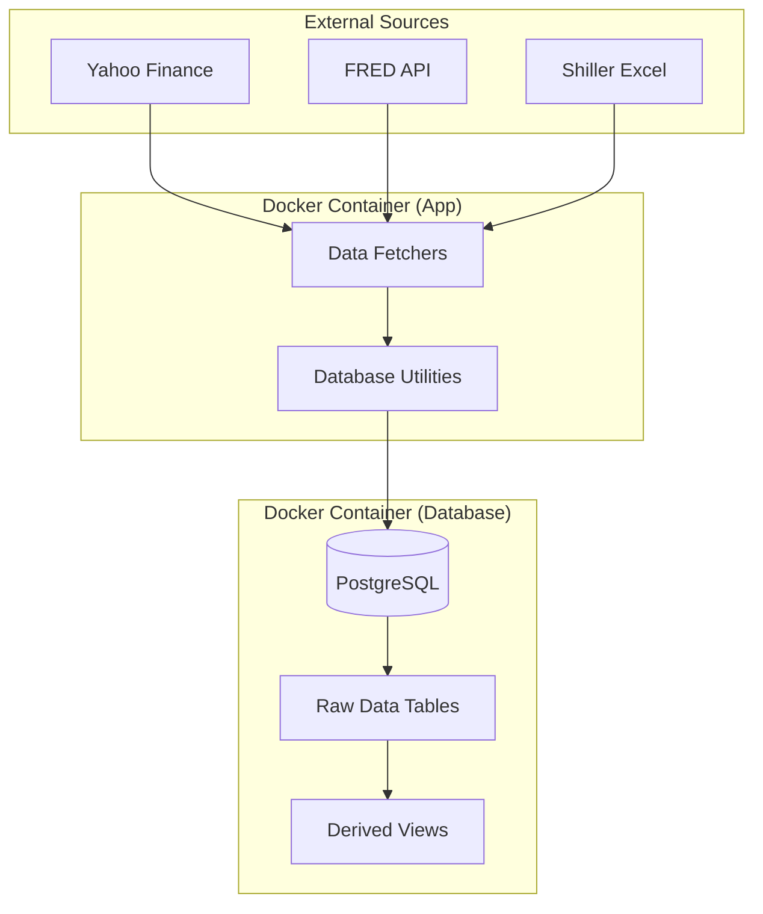

# Architecture Overview

## System Overview

The `financial_db` project is a personal financial data management system designed to run locally on a laptop. It leverages Docker to host a PostgreSQL database, providing an isolated and consistent environment for data storage and analysis.

The core of the system is a Python-based data ingestion pipeline that fetches financial data from various external sources (e.g., Yahoo Finance, FRED, Shiller CAPE) and stores it in the database. Complex financial metrics are then computed directly within the database using SQL views.

## High-Level Architecture

## Key Components

### 1. Data Fetchers (`data_fetchers/`)
These are standalone Python scripts responsible for:
-   Connecting to external APIs or downloading data files.
-   Cleaning and transforming raw data into a structured format (Pandas DataFrame).
-   Using the Database Layer to upsert data into the database.

### 2. Database Layer (`db_utils/`)
Provides a unified interface for database interactions:
-   **`DatabaseConnection`**: A context manager that handles connection pooling (planned) and transaction management.
-   **Schema Definitions**: Defines the structure of tables and primary keys to ensure data integrity.
-   **Upsert Logic**: Handles idempotent inserts using `INSERT ... ON CONFLICT DO UPDATE`.

### 3. Database Schema (`db_utils/db_setup.sql`)
The database is structured into several normalized tables:
-   `assets_prices`: Historical price data for assets.
-   `interest_rates`: Global interest rate data.
-   `indices`: Market index values.
-   `macro_data`: General macroeconomic indicators.

### 4. Derived Metrics (`derived/`)
Complex calculations are offloaded to the database using SQL views. For example, `shiller_derived_view` calculates CAPE ratios and real returns using window functions and CTEs.

## Technology Stack

-   **Language**: Python 3.10+
-   **Database**: PostgreSQL 15
-   **Containerization**: Docker & Docker Compose
-   **Package Management**: `uv`
-   **Data Analysis**: Pandas, NumPy
